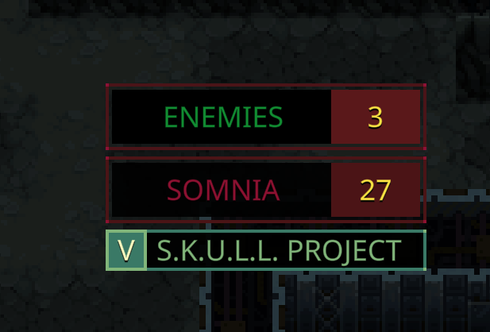

# QM_EnemyCountIndicator

A mod for the game Quasimorph that displays an indicator showing the number of enemies if your operative sees them.
This mod enhances player awareness and strategic decision-making by providing real-time information about enemy presence.

If your operative sees an enemy far away but you don't this mod is for you!

## Features

- **Current Enemy Count**: Displays the current number of enemies in view.
- **Customizable Configuration**: Allows users to adjust settings through a [Mod Configuration Menu (MCM).](https://steamcommunity.com/sharedfiles/filedetails/?id=3469678797)

## Requirements (Optional)

- **MCM (Mod Configuration Menu)**: A configuration menu framework to manage settings via an in-game interface.

As alternative you can find config files in:
- `%AppData%\..\LocalLow\Magnum Scriptum Ltd\Quasimorph_ModConfigs\QM_EnemyCountIndicator\config_mcm.ini`

# Configuration

|Name|Default|Description|
|--|--|--|
|PositionUpperRight|False|Show indicator in upper right corner instead.|
|IndicatorBackgroundColor|#4B1416|Color for the indicator background. Must have the # prefix.|
|IndicatorTextColor|#8D1131|Text color. Must have the # prefix.|
|BlinkIntensity|35|Indicator blink intensity (times per second). Range is 5 to 240.|
|CameraMoveSpeed|10|How quickly camera moves between enemies. Range is 1 to 10.|

# Source Code
Source code is available on [GitHub](https://github.com/ARZUMATA/QM-ARZUMATA-EnemyCountIndicator)

Thanks to NBK_RedSpy, Crynano and all the people who make their code open source.

# Change Log
## 1.0 (9a50fd0)
* Initial release
